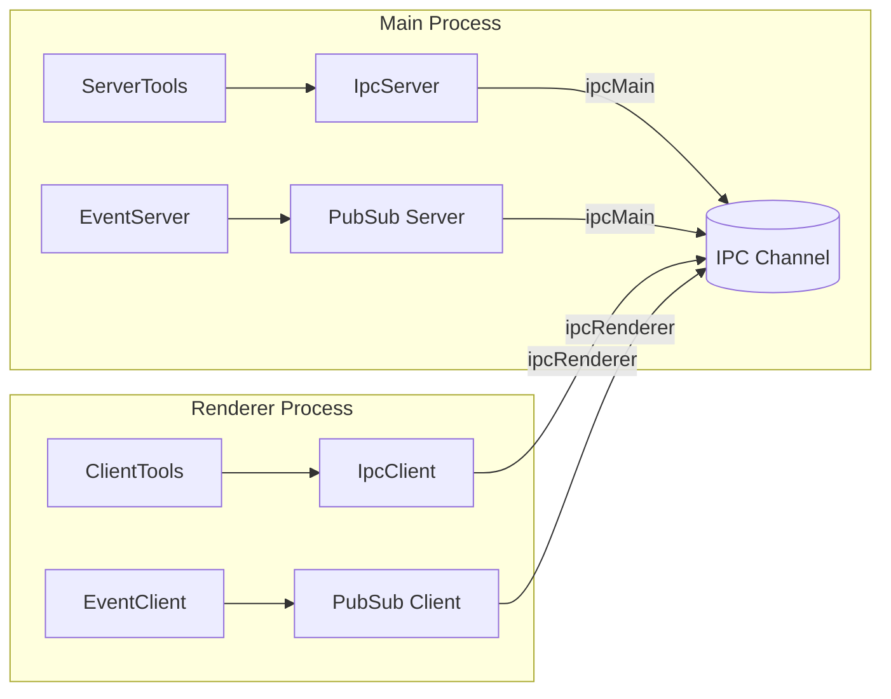

# @isdk/ai-tool-electron

> ✨ **Electron-native IPC Transport for the `ToolFunc` Framework**
> Build decoupled, type-safe, real-time Electron apps with RPC tools and Pub/Sub events over IPC.

[](https://www.npmjs.com/package/@isdk/ai-tool-electron)
[](https://vitest.dev/)
[](https://www.typescriptlang.org/)
[](LICENSE)

```bash
npm install @isdk/ai-tool-electron
```

Built on [`@isdk/ai-tool`](https://github.com/isdk/ai-tool) — Define reusable, self-documenting functions.

## 🌟 Features

Designed to pair with @isdk/ai-tool. Define your business logic once as tools, then call them from the renderer like local methods —— no HTTP required.

* ✅ **Zero network overhead** - uses Electron IPC
* ✅ **RPC Tools over IPC** — Call server-defined functions from renderer
* ✅ **Real-time Event Bus** — Bidirectional Pub/Sub with auto session management
* ✅ **Unified error model** via @isdk/common-error
* ✅ **AbortSignal support** - cancel waiting on the client
* ✅ **Safe Preload Bridge** — Securely expose APIs via `contextBridge`
* ✅ **Dynamic Namespaces** — Run multiple isolated tool/event buses

## 🚀 Quick Start

### 1. Main Process (Server)

```ts
// main.ts
import {
  ServerTools,
  IpcServerToolTransport,
  EventServer,
  ElectronServerPubSubTransport,
} from '@isdk/ai-tool-electron';

// Register a tool
ServerTools.register({
  name: 'getUser',
  func: async ({ id }) => ({ id, name: 'Alice' }),
});

// Mount RPC
const serverTransport = new IpcServerToolTransport();
serverTransport.mount(ServerTools, 'my-app');

// Setup event bus
EventServer.setPubSubTransport(
  new ElectronServerPubSubTransport('my-app-events')
);
EventServer.get().register();

await serverTransport.start(); // No port needed!
```

---

### 2. Preload Script (Secure Bridge)

```ts
// preload.ts
import { contextBridge } from 'electron';
import {
  IpcClientToolTransport,
  ElectronClientPubSubTransport,
  backendEventable,
  EventClient,
} from '@isdk/ai-tool-electron';

contextBridge.exposeInMainWorld('toolBridge', {
  async init() {
    // Mount tools
    const transport = new IpcClientToolTransport('my-app');
    await transport.mount(ServerTools);

    // Setup events
    EventClient.setPubSubTransport(new ElectronClientPubSubTransport());
    backendEventable(EventClient);
    EventClient.get().setApiRoot('my-app-events').register();

    return { ready: true };
  },

  invokeTool: (name, params, options) =>
    ServerTools.get(name)?.run(params, options),

  getEventClient: () => EventClient.get(),
});
```

---

### 3. Renderer Process (Client)

```ts
// renderer.tsx
const { toolBridge } = window;

await toolBridge.init();

// ➡️ Call tool
const user = await toolBridge.invokeTool('getUser', { id: '123' });
console.log(user); // { id: '123', name: 'Alice' }

// 🔔 Listen to events
const ec = toolBridge.getEventClient();
ec.on('user-updated', data => console.log('Updated:', data));
await ec.subscribe('user-updated');

// 📤 Emit event to main process
ec.forwardEvent('local-event');
ec.emit('local-event', { action: 'clicked' });
```

---

## 🔄 Architecture



---

## ⚙️ Advanced

### Timeout & Cancellation

```ts
const ctrl = new AbortController();
setTimeout(() => ctrl.abort(), 5000);

try {
  await tool.run(params, { signal: ctrl.signal, timeout: 10_000 });
} catch (err) {
  if (err.name === 'AbortError') {
    console.log('Cancelled or timed out');
  }
}
```

### Handshake (Optional)

```ts
// Client
pubsub.connect('bus', {
  waitForHandshake: true,
  handshakeTimeout: 5000,
});

// Server auto-responds if client sends `sendHandshake: true`
```

---

## 🧪 Testing

Run unit tests with mocked Electron IPC:

```bash
npm test           # run once
npm run test:watch # dev mode
npm run coverage   # generate report
```

Mocks: `test/mocks/electron.ts`

---

## 📚 Docs

- [ToolFunc Core](https://github.com/isdk/ai-tool/blob/main/docs/toolFunc.md)
- [Transports Guide](https://github.com/isdk/ai-tool/blob/main/docs/transport.md)
- [Events Guide](https://github.com/isdk/ai-tool/blob/main/docs/pubsub.md)

---

## 🤝 Contributing

We ❤️ contributions!

1. Fork → `git clone`
2. Create branch → `git checkout -b feat/your-feature`
3. Commit → `git commit -m 'feat: add XYZ'`
4. Push → `git push origin feat/your-feature`
5. Open PR 🎉

Please ensure tests pass and types are clean.

---

## 📜 License

MIT © [ISDK](https://github.com/isdk) — See [LICENSE](LICENSE)

---

> 💡 **Pro Tip**: Use `EventServer.forward([...events])` to auto-relay global events to all connected clients!
